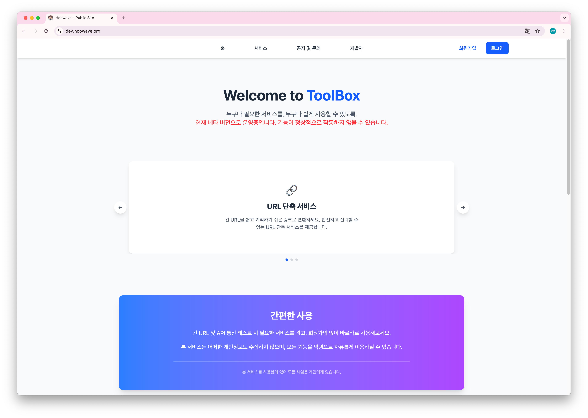
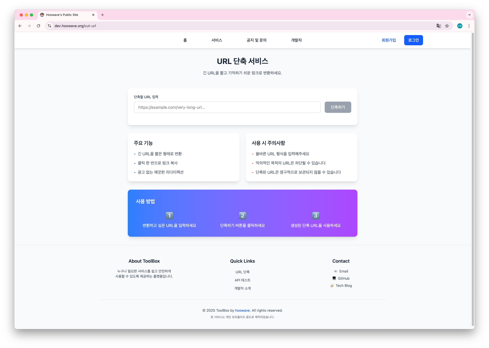
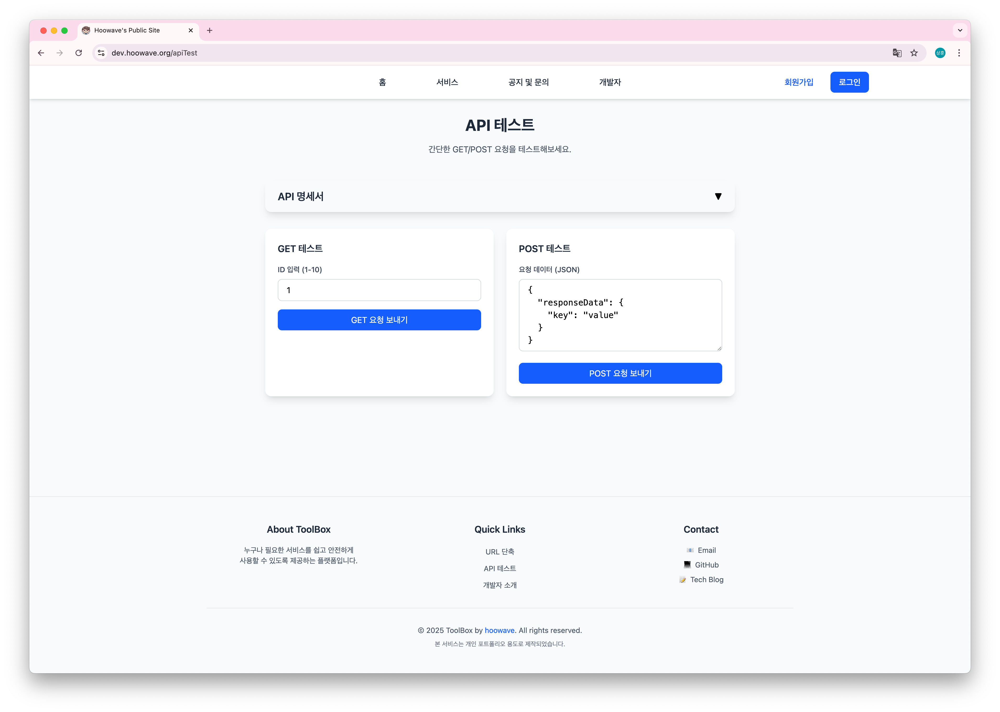
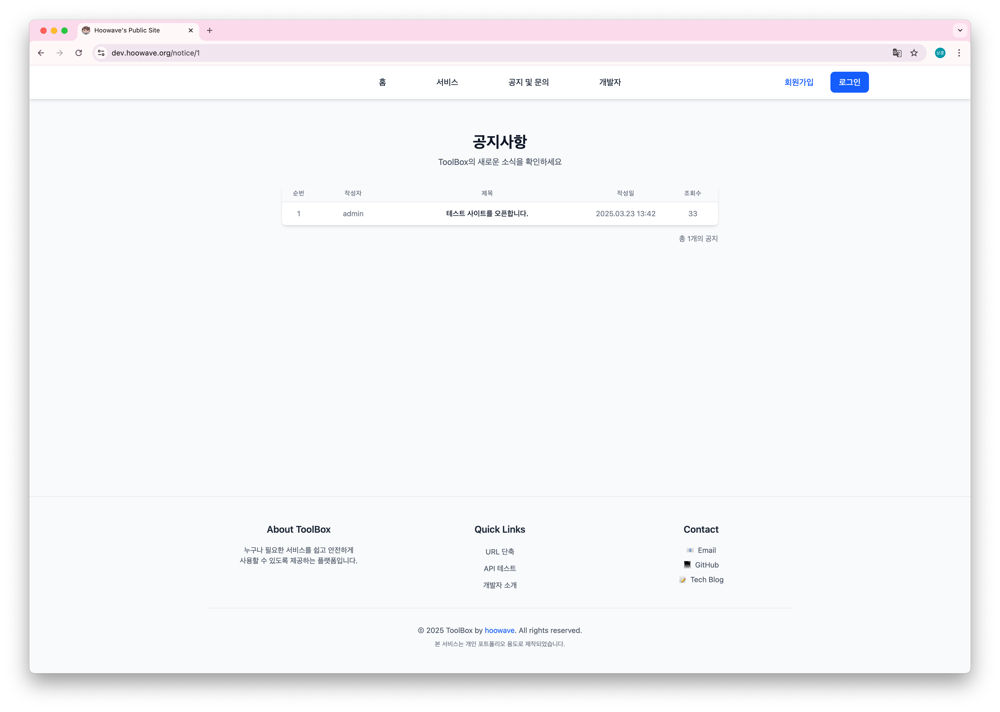
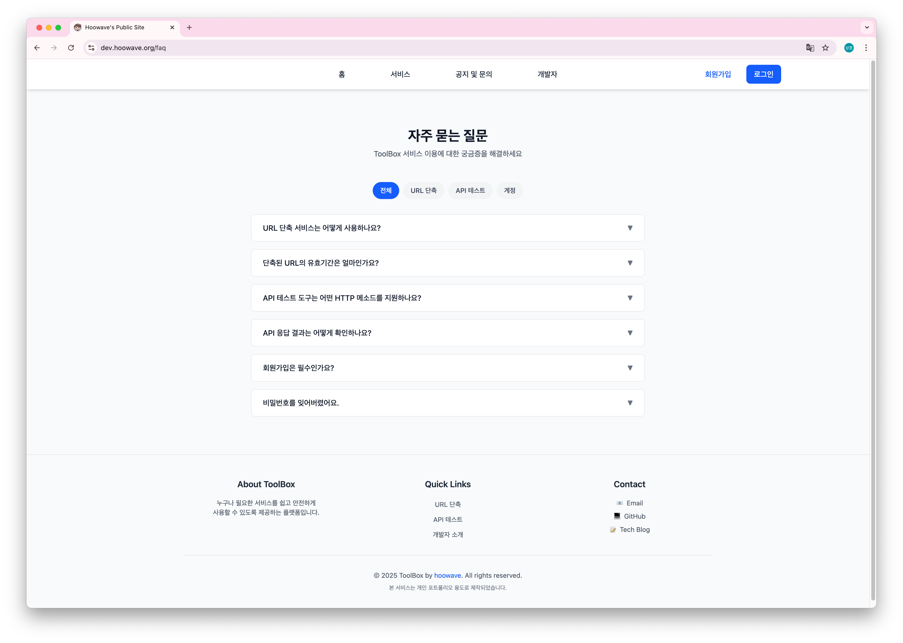

# ToolBox Frontend
누구나 필요한 서비스를, 누구나 쉽게 사용할 수 있도록.<br>
ToolBox 프로젝트의 프론트엔드 서버입니다.

<details>
<summary>스크린샷 보기</summary>

### 메인 페이지


### URL 단축 서비스


### API 테스트


### 공지사항


### FAQ


</details>

## 기술 스택

* React
* TypeScript
* Tailwind CSS
* Framer Motion
* CKEditor

### 프로젝트 구조

프로젝트는 다음과 같은 구조로 구성되어 있습니다:

```
src/
├── components/     # 재사용 가능한 컴포넌트
├── contexts/      # React Context 관련 파일
├── pages/         # 페이지 컴포넌트
├── services/      # API 서비스
├── types/         # TypeScript 타입 정의
└── utils/         # 유틸리티 함수
```

### 주요 기능

* **URL 단축**: 긴 URL을 짧고 기억하기 쉬운 링크로 변환
* **API 테스트**: API 엔드포인트를 쉽고 빠르게 테스트
* **게시판**: 공지사항 및 문의하기 기능
* **리뷰**: 서비스 사용 후기 및 별점 평가

## 개발 환경 설정

### 필수 요구사항

* Node.js 18 이상
* npm 9 이상

### 설치 및 실행

1. 프로젝트 클론
```bash
git clone https://github.com/hoowave/toolbox-frontend.git
cd toolbox-frontend
```

2. 의존성 설치
```bash
npm install
```

3. 개발 서버 실행
```bash
npm run dev
```

## 서버 정보

* 개발 서버 (베타): https://dev.hoowave.org
* 실제 서버: https://hoowave.org (예정)
* API 서버:
  * 개발 환경: https://api-dev.hoowave.org
  * 프로덕션 환경: https://api.hoowave.org

## 연관 프로젝트

* 백엔드: [toolbox-backend](https://github.com/hoowave/toolbox-backend)

## CI/CD

GitHub Actions를 통한 자동화된 배포 파이프라인이 구성되어 있습니다.

## 주의사항

* 현재 베타 버전으로 운영중입니다. 기능이 정상적으로 작동하지 않을 수 있습니다.
* 본 서비스를 사용함에 있어 모든 책임은 개인에게 있습니다.
